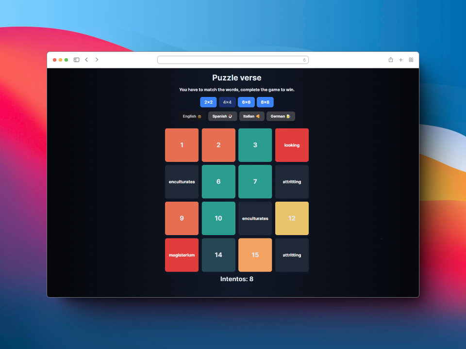

# PuzzleVerse - Word Matching Game

Welcome to PuzzleVerse, the exciting word matching game that will keep you entertained for hours! Match identical words, change languages, customize matrix size, and explore a variety of words fetched from an [API](https://random-word-api.herokuapp.com/home)

## Installation Guide

### Prerequisites
- Make sure you have Node.js installed. You can download it [here](https://nodejs.org/).

### Steps

1. **Clone the repository:**
   ```bash
   git clone https://github.com/isaidj/puzzleverse.git
   ```

2. **Navigate to the project folder:**
   ```bash
   cd puzzleverse
   ```

3. **Install dependencies:**
   ```bash
   npm install
   ```

4. **Run the application:**
   ```bash
   npm run dev
   ```

5. **Open your browser:**
   Visit [http://localhost:3000](http://localhost:3000) to play PuzzleVerse!

## Features

- **Word Matching:** Enjoy the thrill of matching identical words in a grid.
- **Language Switch:** Change the language of the game to challenge yourself.
- **Matrix Size Customization:** Customize the size of the matrix for a different gaming experience.
- **API Integration:** Explore a diverse set of words fetched from an external API.

Feel free to reach out if you have any questions or need further assistance. Have a blast playing PuzzleVerse! 🧩🌐

P.S. If you have any cool features in mind or want to contribute, feel free to dive into the code! Open-source collaboration makes PuzzleVerse even more awesome. 😊
